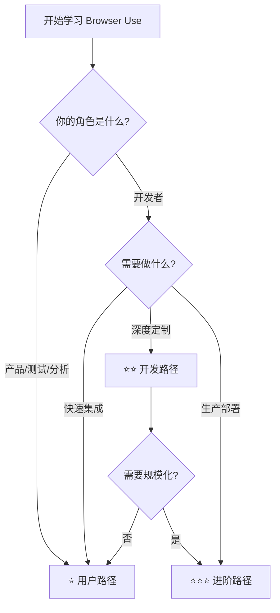

# Browser Use 中文文档 ⭐

> **告诉你的计算机要做什么，它就能完成。**

Browser Use 官方中文文档。本文档已发布至 [Browser Use 中文文档](https://docs.browser-use.com/zh-cn)。

---

## 📚 学习路径导航

本文档采用**渐进式复杂度设计**，为不同阶段的用户提供针对性的学习路径。

### 学习路径选择器

| 路径 | 目标人群 | 前置知识 | 预期时长 | 难度 |
|------|---------|---------|---------|------|
| [⭐用户路径](#-用户路径快速上手) | 产品经理、测试工程师、数据分析师 | 无 | 30分钟 | ⭐ |
| [⭐⭐开发路径](#-开发路径深度集成) | Python 开发者、后端工程师 | Python 基础 | 2小时 | ⭐⭐ |
| [⭐⭐⭐进阶路径](#-进阶路径生产部署) | 架构师、DevOps、SRE | 开发路径 + 生产环境经验 | 4小时 | ⭐⭐⭐ |

### 难度等级说明

- **⭐ 入门级**: 无需编程经验，基础概念理解
- **⭐⭐ 基础级**: 需要 Python 基础，能运行示例代码
- **⭐⭐⭐ 进阶级**: 需要理解异步编程、配置管理
- **⭐⭐⭐⭐ 专家级**: 生产级部署、架构设计、性能优化

---

## ⭐ 用户路径（快速上手）

> **目标**: 了解 Browser Use 核心概念，能使用现成工具完成简单任务

### 必读文档

| 文档 | 难度 | 学习目标 | 预计时长 |
|------|------|---------|---------|
| [项目介绍](./introduction.mdx) | ⭐ | 理解 Browser Use 的核心功能和使用场景 | 10分钟 |
| [快速开始](./quickstart.mdx) | ⭐ | 完成本地安装和首次运行 | 15分钟 |
| [LLM 快速开始](./quickstart_llm.mdx) | ⭐ | 使用 AI 编码助手快速上手 | 5分钟 |

### 实践任务

1. ✅ **任务一**: 安装 Browser Use 并运行第一个 Agent
2. ✅ **任务二**: 让 Agent 完成一次网页搜索
3. ✅ **任务三**: 提取网页内容并保存

### 词汇表（用户版）

| 术语 | 解释 |
|-----|------|
| Agent（代理） | AI 驱动的浏览器自动化执行程序 |
| Task（任务） | 你想让 Agent 完成的指令 |
| LLM（大语言模型） | 提供智能思考能力的大脑 |

---

## ⭐⭐ 开发路径（深度集成）

> **目标**: 掌握 Browser Use API，能自定义 Agent 行为和工具扩展

### 学习路径图

```
快速开始
    ↓
浏览器配置 → Agent 配置 → 工具开发 → 沙箱部署
    ↓           ↓           ↓
  基础设置    行为定制    自定义工具
```

### 必读文档

| 文档 | 难度 | 学习目标 | 实践重点 |
|------|------|---------|---------|
| [自定义浏览器](./customize/browser/basics.mdx) | ⭐⭐ | 配置浏览器参数（窗口大小、代理、User-Agent） | 多浏览器配置 |
| [Agent 配置](./customize/agent/basics.mdx) | ⭐⭐ | 理解 Agent 参数（工具注册表、输出模型等） | 参数调优 |
| [工具开发](./customize/tools/basics.mdx) | ⭐⭐ | 添加自定义工具扩展 Agent 能力 | 工具注册 |
| [工具集成](./customize/tools/add.mdx) | ⭐⭐ | 高级工具开发（文件操作、API 调用） | 复杂工具 |
| [工具移除](./customize/tools/remove.mdx) | ⭐⭐ | 排除默认工具 | 精简工具集 |
| [工具响应](./customize/tools/response.mdx) | ⭐⭐⭐ | 工具返回值的语义化处理 | ActionResult |

### 进阶主题

| 文档 | 难度 | 说明 |
|------|------|------|
| [Actor 基础](./customize/actor/basics.mdx) | ⭐⭐ | 浏览器控制底层 API |
| [Actor 示例](./customize/actor/examples.mdx) | ⭐⭐⭐ | 高级浏览器操作示例 |
| [Actor 参数](./customize/actor/all-parameters.mdx) | ⭐⭐⭐ | 完整参数参考 |
| [Hooks 钩子](./customize/hooks.mdx) | ⭐⭐⭐ | 生命周期钩子扩展 |

### 实践项目

1. **项目一**: 配置带代理的浏览器实例
2. **项目二**: 创建自定义工具（获取 2FA 验证码）
3. **项目三**: 构建多工具 Agent 完成复杂任务

---

## ⭐⭐⭐ 进阶路径（生产部署）

> **目标**: 掌握生产级部署、监控、可观测性和规模化运行

### 部署架构图

```
┌─────────────────────────────────────────────────────────┐
│                    生产环境架构                           │
├─────────────────────────────────────────────────────────┤
│  ┌──────────┐   ┌──────────┐   ┌──────────┐           │
│  │ Sandbox  │   │ Cloud    │   │ 本地集群  │           │
│  │ 快速部署  │   │ 远程浏览器 │   │ 自托管方案 │           │
│  └────┬─────┘   └────┬─────┘   └────┬─────┘           │
│       │              │              │                  │
│       └──────────────┼──────────────┘                  │
│                      ↓                                 │
│            ┌─────────────────┐                        │
│            │  监控与可观测性   │                        │
│            │ (OpenTelemetry) │                        │
│            └─────────────────┘                        │
└─────────────────────────────────────────────────────────┘
```

### 必读文档

| 阶段 | 文档 | 难度 | 学习目标 |
|------|------|------|---------|
| **部署** | [沙箱快速开始](./customize/sandbox/quickstart.mdx) | ⭐⭐⭐ | 理解沙箱概念和基本部署 |
| | [沙箱参数](./customize/sandbox/all-parameters.mdx) | ⭐⭐⭐ | 完整参数配置 |
| | [沙箱事件](./customize/sandbox/events.mdx) | ⭐⭐⭐⭐ | 事件驱动架构 |
| | [生产环境部署](./production.mdx) | ⭐⭐⭐ | 大规模部署指南 |
| **监控** | [可观测性](./development/monitoring/observability.mdx) | ⭐⭐⭐ | 监控体系设计 |
| | [OpenLit 集成](./development/monitoring/openlit.mdx) | ⭐⭐⭐ | 指标采集配置 |
| | [成本管理](./development/monitoring/costs.mdx) | ⭐⭐⭐ | 成本优化策略 |
| | [遥测数据](./development/monitoring/telemetry.mdx) | ⭐⭐⭐ | 匿名使用数据 |
| **浏览器** | [真实浏览器](./customize/browser/real-browser.mdx) | ⭐⭐⭐ | 连接本地 Chrome |
| | [远程浏览器](./customize/browser/remote.mdx) | ⭐⭐⭐ | CDP URL 连接 |
| | [浏览器参数](./customize/browser/all-parameters.mdx) | ⭐⭐⭐ | 完整参数参考 |

### 集成主题

| 文档 | 难度 | 说明 |
|------|------|------|
| [MCP 集成](./customize/integrations/mcp-server.mdx) | ⭐⭐⭐ | Model Context Protocol |
| [Docs MCP](./customize/integrations/docs-mcp.mdx) | ⭐⭐⭐ | 文档 MCP 服务 |
| [代码代理](./customize/code-agent/basics.mdx) | ⭐⭐⭐ | 与 AI 编码助手集成 |
| [代码代理参数](./customize/code-agent/all-parameters.mdx) | ⭐⭐⭐⭐ | 完整参数参考 |
| [代码代理输出](./customize/code-agent/output-format.mdx) | ⭐⭐⭐⭐ | 输出格式配置 |
| [Skills 基础](./customize/skills/basics.mdx) | ⭐⭐⭐ | 技能系统 |

### 示例应用

| 文档 | 难度 | 说明 |
|------|------|------|
| [模板：快速 Agent](./examples/templates/fast-agent.mdx) | ⭐⭐ | 最小化配置模板 |
| [模板：并行浏览器](./examples/templates/parallel-browser.mdx) | ⭐⭐⭐ | 多浏览器并行 |
| [模板：Playwright 集成](./examples/templates/playwright-integration.mdx) | ⭐⭐⭐⭐ | 高级集成模式 |
| [模板：敏感数据](./examples/templates/sensitive-data.mdx) | ⭐⭐⭐ | 安全数据处理 |
| [应用：广告检测](./examples/apps/ad-use.mdx) | ⭐⭐⭐ | 实际应用案例 |
| [应用：消息处理](./examples/apps/msg-use.mdx) | ⭐⭐⭐ | 消息队列集成 |

---

## 🔍 术语表（完整版）

| 英文术语 | 中文术语 | 说明 | 难度 |
|---------|---------|------|------|
| Agent | 代理/智能体 | AI 驱动的浏览器自动化执行程序 | ⭐ |
| Browser | 浏览器 | Chromium 浏览器实例 | ⭐ |
| LLM | 大语言模型 | Large Language Model | ⭐ |
| CDP | CDP 协议 | Chrome DevTools Protocol | ⭐⭐ |
| Sandbox | 沙箱 | 隔离的浏览器执行环境 | ⭐⭐⭐ |
| API | API / 应用程序接口 | Application Programming Interface | ⭐ |
| SDK | SDK / 软件开发包 | Software Development Kit | ⭐ |
| Controller | 控制器 | 工具注册表，管理 Agent 可用工具 | ⭐⭐ |
| Actor | 执行器 | 底层浏览器控制 API | ⭐⭐⭐ |
| Tool | 工具 | Agent 可调用的扩展功能 | ⭐⭐ |
| Action | 动作 | Agent 执行的具体操作 | ⭐⭐ |
| Task | 任务 | Agent 需要完成的指令 | ⭐ |
| Step | 步骤 | Agent 执行过程中的单步操作 | ⭐⭐ |
| Memory | 记忆 | Agent 的长期/短期记忆机制 | ⭐⭐⭐ |
| Vision | 视觉 | Agent 的视觉理解能力 | ⭐⭐ |

---

## 🛠️ 开发者资源

### 开发环境

| 资源 | 说明 | 难度 |
|------|------|------|
| [本地开发环境](./development/setup/local-setup.mdx) | 开发环境配置 | ⭐⭐ |
| [贡献指南](./development/setup/contribution-guide.mdx) | 代码贡献流程 | ⭐⭐⭐ |

### 社区支持

| 资源 | 说明 |
|------|------|
| [获取帮助](./development/get-help.mdx) | 社区资源和联系渠道 |
| [FAQ 常见问题](./development.mdx) | 快速解答 |
| [路线图](./development/roadmap.mdx) | 未来规划 |
| [n8n 集成](./development/n8n-integration.mdx) | 工作流自动化 |

---

## 📖 文档使用指南

### 如何选择学习路径



### 学习建议

1. **循序渐进**: 建议按路径顺序学习，不要跳跃
2. **动手实践**: 每个概念都要运行示例代码
3. **项目驱动**: 学完一个阶段后完成对应的实践项目
4. **查阅参考**: 遇到问题查看参数文档和 FAQ

---

## 🤝 贡献指南

欢迎为本项目贡献中文文档！请遵循以下步骤：

1. Fork 本仓库
2. 创建特性分支：`git checkout -b docs/zh-cn/your-feature`
3. 提交更改：`git commit -m 'docs: 添加 xxx 文档'`
4. 推送到分支：`git push origin docs/zh-cn/your-feature`
5. 创建 Pull Request

### 贡献原则

- ✅ 术语一致性：使用官方术语表
- ✅ 渐进式设计：标明难度等级
- ✅ 示例驱动：每个概念配示例
- ✅ 实践导向：包含动手练习

---

## 📞 反馈与支持

如果您在使用过程中遇到问题或有改进建议，请通过以下方式联系我们：

- [GitHub Issues](https://github.com/browser-use/browser-use/issues)
- [Discord 社区](https://link.browser-use.com/discord)
- 邮箱：support@browser-use.com

---

<div align="center">

**⭐ 学习路径完成度追踪**

- [ ] ⭐ 用户路径（完成 3 个必读文档 + 3 个实践任务）
- [ ] ⭐⭐ 开发路径（完成 3 个必读文档 + 3 个实践项目）
- [ ] ⭐⭐⭐ 进阶路径（完成 3 个必读文档 + 1 个生产部署项目）

</div>

---

**告诉你的计算机要做什么，它就能完成。**
