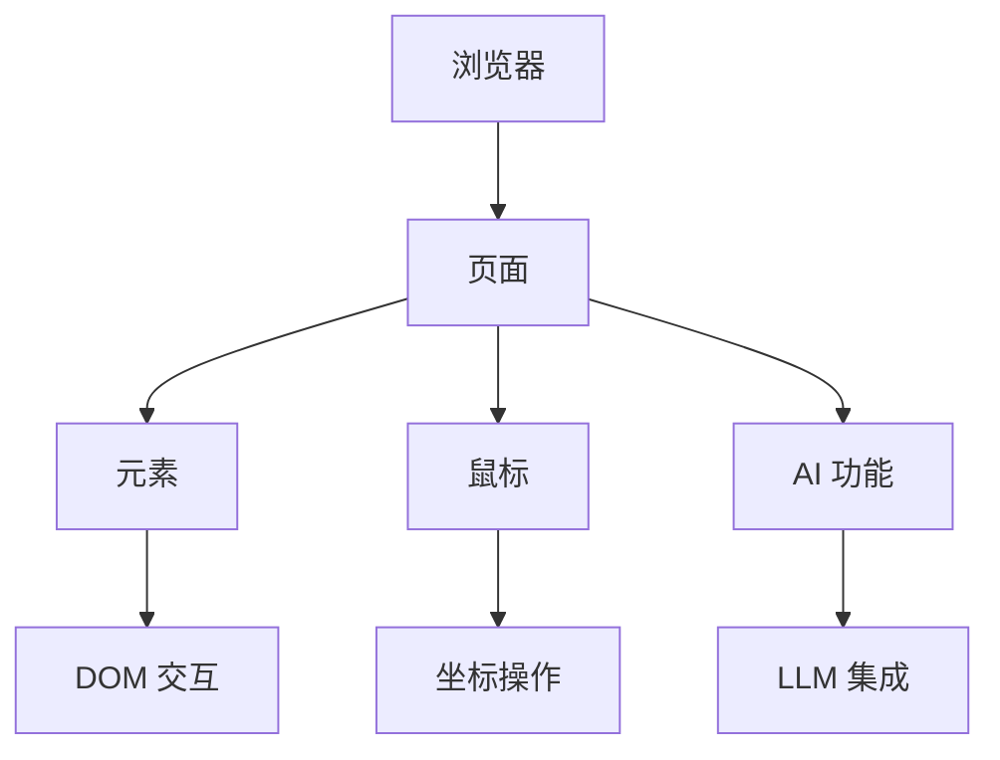

## 核心架构



### 核心类

- **Browser**（别名：**BrowserSession**）：主会话管理器
- **Page**：表示浏览器标签页或 iframe
- **Element**：单个 DOM 元素操作
- **Mouse**：基于坐标的鼠标操作

## 基础用法

```python
from browser_use import Browser, Agent
from browser_use.llm.openai.chat import ChatOpenAI

async def main():
    llm = ChatOpenAI(api_key="your-api-key")
    browser = Browser()
    await browser.start()

    # 1. Actor：精确导航和元素交互
    page = await browser.new_page("https://github.com/login")
    email_input = await page.must_get_element_by_prompt("username field", llm=llm)
    await email_input.fill("your-username")

    # 2. Agent：AI 驱动的复杂任务
    agent = Agent(browser=browser, llm=llm)
    await agent.run("完成登录并导航到我的仓库")

    await browser.stop()
```

## 重要说明

- **不是 Playwright**：Actor 基于 CDP 构建，而非 Playwright。API 类似 Playwright 以便于迁移，但功能是子集。
- **即时返回**：`get_elements_by_css_selector()` 不等待元素可见
- **手动计时**：你需要处理导航时序和等待
- **JavaScript 格式**：`evaluate()` 需要箭头函数格式：`() => {}`

## 与 Agent 的区别

| 特性 | Actor | Agent |
|-----|-------|-------|
| 控制方式 | 精确的代码控制 | AI 驱动的自然语言 |
| 学习曲线 | 需要编程知识 | 自然语言描述 |
| 适用场景 | 简单重复任务 | 复杂、需要决策的任务 |
| 灵活性 | 高，完全可控 | 高，AI 自动规划 |

## 常用操作

### 页面操作

```python
# 创建新页面
page = await browser.new_page("https://example.com")

# 获取当前页面
page = await browser.must_get_current_page()

# 关闭页面
await page.close()
```

### 元素操作

```python
# 使用 LLM 提示获取元素
element = await page.must_get_element_by_prompt("搜索框", llm=llm)

# 使用 CSS 选择器获取元素
elements = await page.get_elements_by_css_selector('input[type="text"]')

# 点击元素
await element.click()

# 输入文本
await element.fill("Hello, World!")

# 获取元素文本
text = await element.get_text()
```

### JavaScript 执行

```python
# 执行 JavaScript
result = await page.evaluate(
    "() => document.title"
)

# 在元素上执行
result = await element.evaluate(
    "el => el.value"
)
```

## 相关资源

- [Actor 所有参数](./all-parameters.mdx)
- [Agent 配置](/customize/agent/basics)
- [浏览器基础](/customize/browser/basics)
